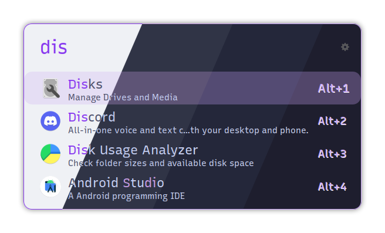
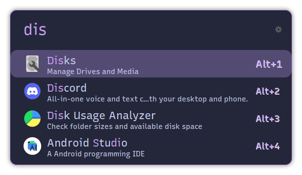

<h3 align="center">
	<br/>
	
	Catppuccin for <a href="https://github.com/Ulauncher/Ulauncher/">Ulauncher</a>
	
</h3>

<p align="center">
	<a href="https://github.com/catppuccin/ulauncher"></a>
	<a href="https://github.com/catppuccin/ulauncher/issues"></a>
	<a href="https://github.com/catppuccin/ulauncher/contributors"></a>
</p>

<p align="center">
	
</p>

## Previews

<details>
<summary>🌻 Latte</summary>

</details>
<details>
<summary>🪴 Frappé</summary>

</details>
<details>
<summary>🌺 Macchiato</summary>

</details>
<details>
<summary>🌿 Mocha</summary>

</details>


## Preperation

    git clone https://github.com/catppuccin/ulauncher.git
    cd ulauncher
    chmod +x ./install.sh
    
## Options
| Command | Description 	|
| ------- | -------------------	|
| --flat | Installs the themes without the round border |
| --all   | Installs all themes |
| --latte | Installs all latte themes |
| --latte-(accent) | Installs the latte theme corresponding to the accent |
| --frappe | Installs all frappe themes |
| --frappe-(accent) | Installs the frappe theme corresponding to the accent |
| --macchiato | Installs all macchiato themes |
| --macchiato-(accent) | Installs the macchiato theme corresponding to the accent |
| --mocha | Installs all mocha themes |
| --mocha-(accent) | Installs the mocha theme corresponding to the accent |

#### Accents

- rosewater
- flamingo
- pink
- mauve
- red
- maroon
- peach
- yellow
- green
- teal
- sky
- sapphire
- blue
- lavender

## Install Examples
    
```./install.sh --all --flat```

```./install.sh --all```

```./install.sh --latte --mocha```

```./install.sh --frappe-red --flat```    

```./install.sh --frappe-mauve --frappe-lavender```
    
Now you can select the theme and enjoy it :D

## 💝 Thanks to

- [lighttigerXIV](https://github.com/lighttigerxiv)
- [Xurdejl](https://github.com/Xurdejl)
- [Amy](https://github.com/nullishamy)

&nbsp;

<p align="center">
	
</p>

<p align="center">
	Copyright &copy; 2021-present <a href="https://github.com/catppuccin" target="_blank">Catppuccin Org</a>
</p>

<p align="center">
	<a href="https://github.com/catppuccin/catppuccin/blob/main/LICENSE"></a>
</p>
